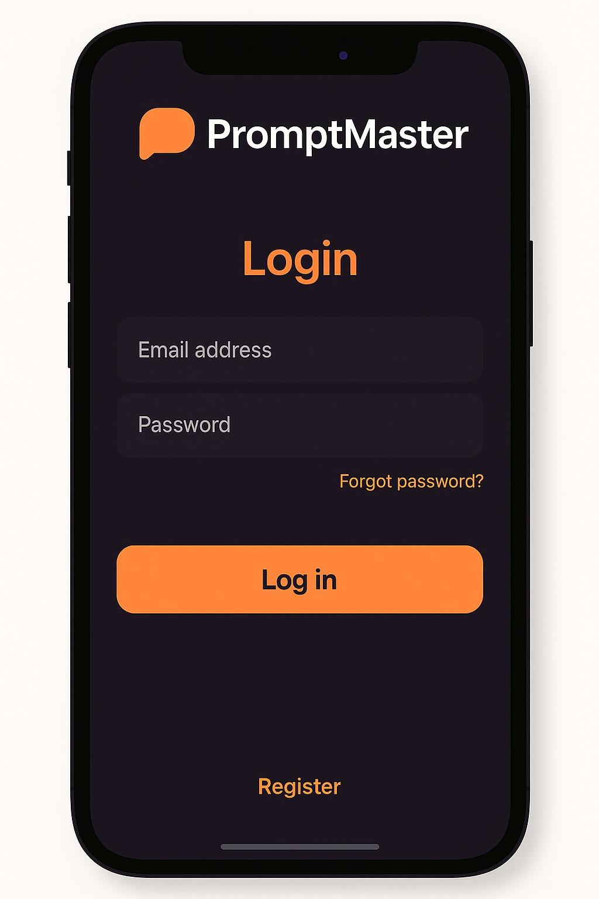
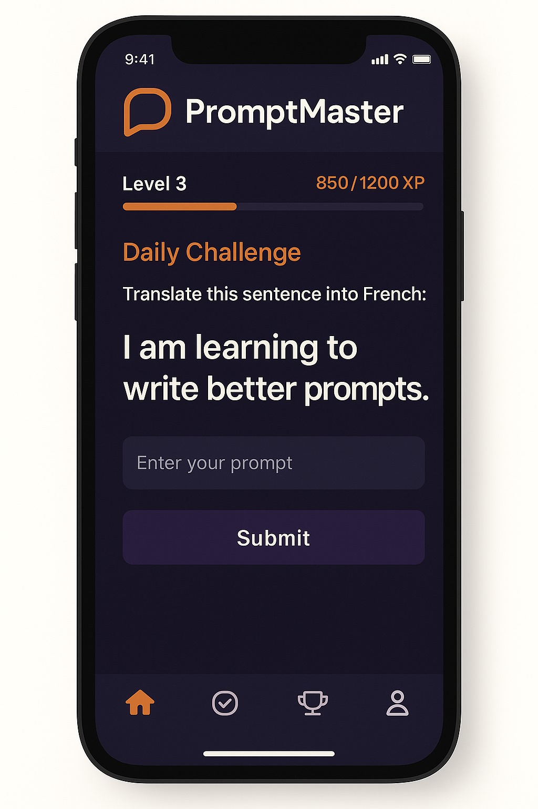
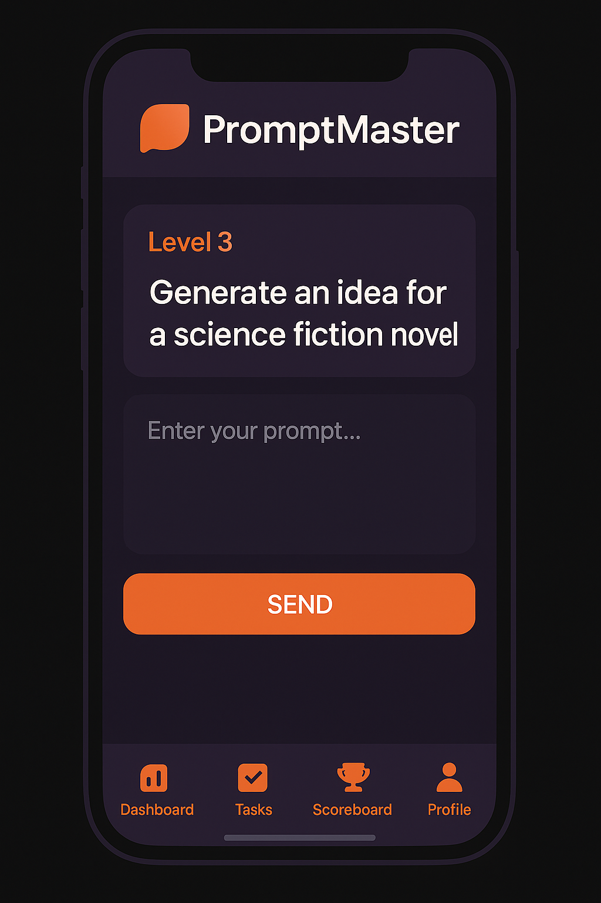
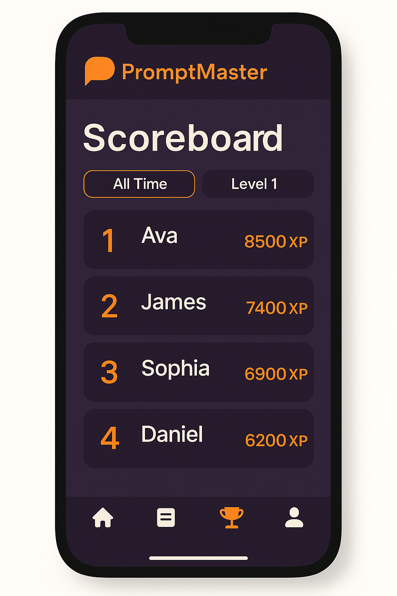
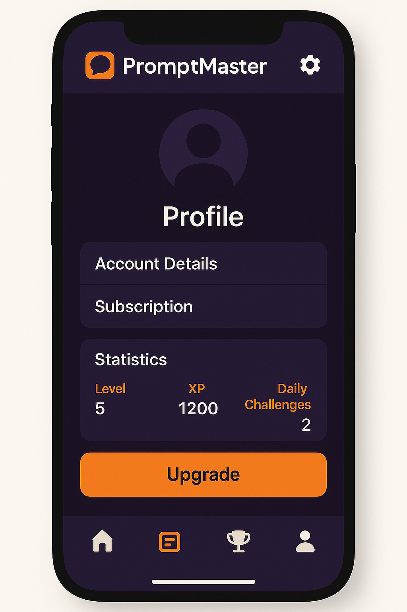
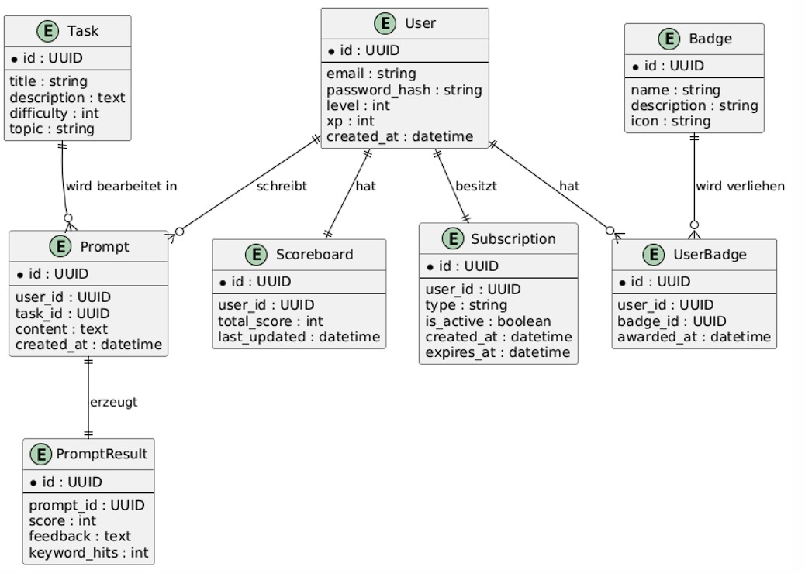
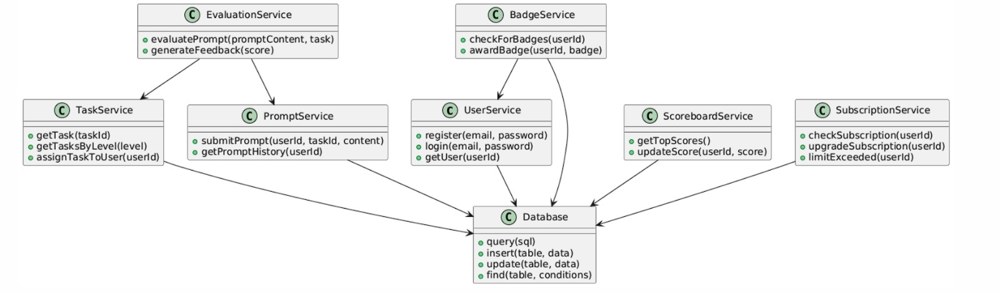

# Anforderungs- und Entwurfsspezifikation ("Pflichtenheft")

# Titelseite

**Produktname:** PromptMaster  
**Autoren:** Mattis Wellenbüscher, Marvin Petschulat  
**Link zum Source Code Repository:** https://github.com/orgs/Full-Stack-Developement-SS25/repositories

**Inhaltsverzeichnis:**  
* 1 Einführung  
* 2 Anforderungen  
  * 2.1 Stakeholder  
  * 2.2 Funktionale Anforderungen  
  * 2.3 Nicht-funktionale Anforderungen  
  * 2.4 Graphische Benutzerschnittstelle  
  * 2.5 Anforderungen im Detail  
* 3 Technische Beschreibung  
  * 3.1 Systemübersicht  
  * 3.2 Softwarearchitektur  
  * 3.3 Schnittstellen  
  * 3.4 Datenmodell  
  * 3.5 Abläufe  
  * 3.6 Entwurf  
  * 3.7 Fehlerbehandlung  
  * 3.8 Validierung  
* 4 Projektorganisation  
  * 4.1 Annahmen  
  * 4.2 Verantwortlichkeiten  
  * 4.3 Grober Projektplan  
* 5 Anhänge  
  * 5.1 Glossar  
  * 5.2 Referenzen  
  * 5.3 Index  

# 1 Einführung

## 1.1 Beschreibung

"PromptMaster" ist eine mobile iOS-Lernanwendung, die Nutzer:innen Schritt für Schritt das sogenannte Prompt Engineering beibringt. Die App vermittelt den effektiven Umgang mit textbasierten KI-Modellen (Large Language Models, kurz: LLMs), wie sie z. B. in Chatbots oder Schreibassistenten eingesetzt werden. Nutzer:innen erhalten zunehmend komplexere Aufgaben und müssen passende Prompts formulieren, um die KI zu einer Lösung zu führen. Die Qualität der Ergebnisse wird durch eine Bewertung, Feedback und Hinweise zu Verbesserungspotenzialen reflektiert.

Zusätzlich bietet die App ein Gamification-System mit Leveln, Abzeichen und optionalen Challenges. Eine Account-Funktion sowie ein Score-System ermöglichen Nutzer:innen Fortschritte zu speichern und sich mit anderen zu vergleichen. In der Basisversion ist die Nutzung begrenzt – eine Monetarisierung erfolgt über ein Abo-Modell.

Die App richtet sich an ein breites Publikum: Schüler:innen, Studierende, Berufstätige und Bildungseinrichtungen. Durch gezielte Schulung in KI-Kompetenzen wird ein gesellschaftlich zunehmend relevanter Bereich zugänglich gemacht.

## 1.2 Abgrenzung
Im Gegensatz zu bestehenden Lernplattformen wie LearnPrompting.org, die hauptsächlich theoretisches Wissen vermitteln, setzt PromptMaster auf einen interaktiven, spielerischen Lernansatz. Nutzer:innen erlernen das Prompten durch praktische Aufgaben, erhalten direktes Feedback zu ihren Eingaben und verbessern sich durch gezielte Wiederholung. Dabei motivieren Level, Abzeichen und ein Score-System dazu, kontinuierlich zu üben. Die App vermittelt das Wissen also nicht nur, sondern macht es anwendbar – und das auf unterhaltsame Weise.
PromptMaster ist keine allgemeine E-Learning-Plattform und kein theoretisches Nachschlagewerk für KI oder Machine Learning. Die App ist nicht darauf ausgelegt, vollständige Lehrpläne zu ersetzen oder wissenschaftliche Tiefe in NLP zu vermitteln. Ebenso ist sie keine Chat-Anwendung oder ein Interface zur freien Nutzung von LLMs. Vielmehr liegt der Fokus auf der spielerischen und strukturierten Vermittlung von Prompting-Fähigkeiten anhand konkreter Aufgaben.

## 1.3 Konkurrenzanalyse & Alternativen
PromptMaster adressiert einen wachsenden Bedarf: das strukturierte Erlernen von Prompt Engineering für Large Language Models (LLMs). Alternativen zur App existieren in unterschiedlichen Formen – etwa als theoretisch geprägte Lernplattformen wie LearnPrompting.org, als praxisorientierte Tools wie PromptOK oder als KI-Entwicklungsumgebungen wie Promptmetheus. Auch das direkte Experimentieren mit KIs wie ChatGPT stellt für viele Nutzer:innen eine informelle Möglichkeit dar, sich mit Prompts auseinanderzusetzen. Zusätzlich gibt es klassische Ansätze wie Online-Kurse, PDF-Leitfäden oder Prompt-Sammlungen auf GitHub.

Was diesen Ansätzen jedoch oft fehlt, ist ein strukturierter Lernpfad, gezieltes Feedback und eine motivierende Nutzerführung. PromptMaster schließt diese Lücke durch ein mobiles, gamifiziertes Konzept mit Level-System, Challenges und aufeinander aufbauenden Aufgaben. Die App hebt sich dadurch deutlich von anderen Lösungen ab und unterstützt Lernende aktiv bei der Verbesserung ihrer Prompt-Kompetenz – statt sie nur mit Inhalten zu versorgen.

# 2 Anforderungen

## 2.1 Stakeholder

| Funktion / Relevanz                         | Name             | Kontakt / Verfügbarkeit                   | Wissen                                      | Interessen / Ziele                               |
|---------------------------------------------|------------------|-------------------------------------------|---------------------------------------------|---------------------------------------------------|
| Nutzer:innen / Zielgruppe                   | Allgemein        | jederzeit erreichbar (App-User)           | Lernwillig, unterschiedliche Vorkenntnisse  | Bessere Prompter werden, Spaß beim Lernen        |
| Bildungseinrichtungen                       | Schulen, Unis    | unterschiedlich                           | möchten moderne Kompetenzen vermitteln      | Motivation & KI-Kompetenz fördern                |
| KI-Dienstleister (z. B. OpenAI, HuggingFace)| Drittanbieter    | abhängig von API-Nutzung                  | Zugriff auf LLMs                            | Integration ihrer Dienste, faire Nutzung         |
| Entwickler:innen (Team)                     | Mattis Wellenbüscher, Marvin Petschulat | marvin.petschulat@hsbi.de mattis.wellenbuescher@hsbi.de /jederzeit                                  | kennen Anforderungen & Architektur          | Projekt erfolgreich umsetzen, Note erhalten      |

Der Markt für KI-Anwendungen und insbesondere für den Einsatz von LLMs wie ChatGPT, Gemini oder Claude wächst rasant. Gleichzeitig steigt der Bedarf an Kompetenzen im Umgang mit diesen Systemen – sowohl im Bildungsbereich als auch in der Wirtschaft. Unternehmen erwarten zunehmend, dass Mitarbeitende in der Lage sind, KI-Tools effizient zu nutzen. Auch Bildungseinrichtungen suchen nach modernen, praxisnahen Formaten, um diese Schlüsselkompetenzen zu vermitteln. Darüber hinaus besteht eine hohe Nutzerakzeptanz für gamifizierte Lern-Apps, was sich am Erfolg vergleichbarer Konzepte wie Duolingo zeigt. PromptMaster erfüllt diese Marktanforderungen durch eine niederschwellige, interaktive Lernlösung mit direktem Praxisbezug.

## 2.1.1 Bedarfsanalyse

Die Zielgruppe von PromptMaster umfasst sowohl Einsteiger:innen als auch fortgeschrittene Nutzer:innen im Umgang mit KI. Dazu zählen insbesondere Schüler:innen ab der Mittelstufe, Studierende aller Fachrichtungen sowie Berufstätige in wissensintensiven Bereichen. Das Bildungsniveau reicht dabei von allgemeinbildend bis akademisch. Die Vorerfahrung im Bereich Prompt Engineering ist meist gering – viele haben zwar KI-Tools wie ChatGPT ausprobiert, aber nie strukturiert gelernt, wie man diese effektiv nutzt.

PromptMaster adressiert zentrale Bedürfnisse dieser Nutzergruppe: den Wunsch nach verständlichem Zugang zu KI-Werkzeugen, das gezielte, effektive Lernen von Prompt-Techniken sowie die Motivation, Fortschritte sichtbar zu machen. Durch einen schrittweisen Lernpfad, spielerische Elemente und direktes Feedback schafft die App eine motivierende Lernumgebung, die unabhängig vom technischen Hintergrund funktioniert. Auch Bildungseinrichtungen und Unternehmen erkennen zunehmend den Bedarf, KI-Kompetenzen praxisnah zu fördern – PromptMaster bietet dafür eine moderne, skalierbare Lösung.

| Kategorie | Inhalt |
|----------|--------|
| **Stärken (Strengths)** | - Spielerischer Lernansatz (Gamification)<br>- Mobiloptimiert & iOS-fokussiert<br>- Strukturierter Lernpfad für KI-Kompetenz<br>- Einfache Einstiegshürde für breite Zielgruppen |
| **Schwächen (Weaknesses)** | - Kein direkter Zugang zu Premium-LLMs (z. B. GPT-4)<br>- Ggf. eingeschränkte Bewertungsgenauigkeit durch Keyword-Matching<br>- Nur iOS, keine Android-Unterstützung (aktuell) |
| **Chancen (Opportunities)** | - Wachsender Bildungs- & KI-Markt<br>- Einbindung in Schulen/Hochschulen<br>- Ausbau zum plattformübergreifenden Lernsystem<br>- Ergänzung durch Community-Features |
| **Risiken (Threats)** | - Zeit- & Kapazitätsengpässe im studentischen Team<br>- Technische Komplexität bei der Bewertung<br>- Konkurrenz durch große KI-Anbieter mit Lernfunktionen<br>- Monetarisierung schwierig ohne Budget/Kapital |

## 2.1.2 Personas
---

### **Persona 1: Lisa, 17, Schülerin (Bildungseinrichtung/Zielgruppe)**  
**Motivation:** Möchte ihre KI-Kompetenzen verbessern, um in der Schule und später im Studium besser mit digitalen Tools umgehen zu können.  
**Vorerfahrung:** Erste Erfahrungen mit ChatGPT, keine strukturierten Kenntnisse im Prompt Engineering.  
**Ziel:** Interaktiv und spielerisch lernen, schnelle Erfolgserlebnisse durch Levelsystem.

---

### **Persona 2: Jonas, 22, Informatikstudent (Zielgruppe)**  
**Motivation:** Möchte sein KI-Wissen im Studium vertiefen und praktische Fähigkeiten zur Anwendung von LLMs erwerben.  
**Vorerfahrung:** Fundierte Informatikkenntnisse, nutzt KI bereits für Codegenerierung.  
**Ziel:** Gezielt Prompts optimieren und die Bewertung nachvollziehen, um Best Practices zu entwickeln.

---

### **Persona 3: Frau Dr. Keller, 45, Lehrkraft an einer Hochschule (Bildungseinrichtung)**  
**Motivation:** Sucht nach modernen Lehrmitteln, um KI-Kompetenz in Vorlesungen einzubetten.  
**Vorerfahrung:** Didaktische Erfahrung, keine tiefen Kenntnisse in LLM-Technologie.  
**Ziel:** Skalierbare Lösung für Studierende, begleitende Monitoring-Optionen wünschenswert.

---

### **Persona 4: Herr Berg, 38, Projektmanager in einem Unternehmen (Berufstätiger)**  
**Motivation:** Möchte Prompts effizient schreiben, um KI-Tools wie ChatGPT bei der Arbeit produktiv zu nutzen.  
**Vorerfahrung:** Tools wie Notion AI oder ChatGPT gelegentlich genutzt, aber ohne Systematik.  
**Ziel:** Praxisnahes Training ohne technisches Overhead, schnelle Integration in den Arbeitsalltag.

---

### **Persona 5: Externer KI-Dienstleister (z. B. OpenAI, HuggingFace)**  
**Rolle:** Stellt die LLM-Funktionalität bereit und wird über APIs angebunden.  
**Interesse:** Stabiler, transparenter Zugriff auf die Modelle, Einhaltung der Nutzungsrichtlinien, ggf. Branding oder Analytics.

---

### **Persona 6: Marvin & Mattis (Entwicklerteam)**  
**Motivation:** Erfolgreiche Projektumsetzung, Erfüllung der Hochschulanforderungen.  
**Rolle:** Technische Planung, Implementierung, Evaluation und Weiterentwicklung.  
**Ziel:** Sauber dokumentiertes, wartbares und nutzerzentriertes Produkt mit realem Mehrwert.


## 2.2 Funktionale Anforderungen

- Nutzer:innen können sich registrieren, einloggen und ihr Profil verwalten  
- Es gibt aufgabenbasierte Lerneinheiten, die nach Schwierigkeit gestaffelt sind  
- Nutzer:innen können Prompts eingeben, um Aufgaben zu lösen  
- Die Antwort wird mithilfe eines LLMs (z. B. GPT-4) generiert und anschließend ebenfalls durch ein LLM auf Qualität, Klarheit und Aufgabenbezug bewertet. Dabei erfolgt die Rückmeldung in Form eines Scores sowie erklärendem Feedback bei Premium Version.
- Nutzer:innen erhalten Feedback & Verbesserungshinweise  
- Punkte (XP) werden vergeben; Fortschritt wird gespeichert  
- Es gibt ein Levelsystem, bei dem Nutzer:innen durch das Abschließen von Aufgaben aufsteigen  
- Abzeichen werden für bestimmte Leistungen vergeben (z. B. perfekte Prompts, Streaks)  
- Tägliche und wöchentliche Challenges mit spezifischen Aufgabenstellungen fördern die Wiederholung  
- Scoreboard vergleicht Nutzer:innen (global / mit Freunden / nach Zeitraum filterbar)  
- Eine grafische Fortschrittsanzeige (XP-Balken, Level, Tagesziel) motiviert dauerhaft  
- Nutzer:innen können (in der Premium-Version) eigene Challenges erstellen, die nach Review veröffentlicht werden können  
- Aufgaben sind limitiert, erweiterbar durch Abo-Modell (Freemium)


## 2.3 Nicht-funktionale Anforderungen

### 2.3.1 Rahmenbedingungen

- Flutter als Framework
- iOS-kompatibel (aktuelle Versionen)
- Optionale erzeugung von Webseite aus Codebasis
- Backend basiert auf Node.js mit REST API
- Datenbank: PostgreSQL
- (Anbindung an KI Dienst per API)

### 2.3.2 Betriebsbedingungen

- Internetzugang nötig für LLM-Funktionalität
- Lokaler Cache für Aufgaben möglich
- Eingeschränkte Offline-Funktion

### 2.3.3 Qualitätsmerkmale

Qualitätsmerkmal     | sehr gut | gut | normal | nicht relevant
---------------------|----------|-----|--------|----------------
Zuverlässigkeit      |          |  X  |        |       
Fehlertoleranz       |          |  X  |        |       
Wiederherstellbarkeit|    X     |     |        |       
Ordnungsmäßigkeit    |    X     |     |        |       
Richtigkeit          |    X     |     |        |       
Konformität          |          |  X  |        |       
Benutzerfreundlichkeit|         |  x  |        |       
Installierbarkeit    |          |     |   X    |       
Verständlichkeit     |    X     |     |        |       
Erlernbarkeit        |    X     |     |        |       
Bedienbarkeit        |          |  X  |        |       
Zeitverhalten        |          |     |   X    |       
Effizienz            |          |     |        |   X    
Analysierbarkeit     |    X     |     |        |       
Modifizierbarkeit    |          |     |        |   X    
Stabilität           |    X     |     |        |       
Prüfbarkeit          |    X     |     |        |       

## 2.4 Graphische Benutzerschnittstelle

Die graphische Benutzerschnittstelle wird mit Flutter realisiert und ist für iOS optimiert. Die Screens orientieren sich am typischen Flow einer Lern-App.

### Screens

#### Startscreen

- Optionen: Einloggen, Registrieren
- Weiterleitung zum Dashboard nach erfolgreicher Anmeldung
- Verknüpfte User Story:
  - | Als | möchte ich | so dass | Akzeptanz |
    |-----|------------|---------|------------|
    | Nutzer | mich einloggen | ich auf meine persönlichen Lernfortschritte zugreifen kann | Login funktioniert bei gültigen Zugangsdaten |

#### Dashboard / Übersicht

- Anzeige von Level, XP, Fortschritt
- Verfügbare Aufgaben des Tages/Woche
- Zugang zu bisherigen Ergebnissen und Profil
- Verknüpfte User Stories:
  - Zugriff auf Aufgaben
  - Überblick über Lernstand

#### Aufgaben-Screen

- Aufgabenstellung wird angezeigt
- Prompt-Eingabefeld
- „Senden“-Button zur Bewertung
- KI-Antwort erscheint unterhalb
- Bewertung + Feedback erscheint nach KI-Antwort
- Verknüpfte User Stories:
  - Prompteingabe und Feedback
  - Bewertung auf Basis von Keywords

#### Scoreboard / Vergleich

- Anzeige von Highscores (global oder Freunde)
- Optionaler Filter: Zeitraum, Level
- Verknüpfte User Story:
  - Motivation durch Vergleich mit anderen

#### Profil / Einstellungen

- Account-Details, Fortschritt, Statistiken
- Abo-Modell / Limitanzeige / Upgrade-Möglichkeit

### Navigation
Die Navigation erfolgt über ein tab-basiertes Bottom-Navigation-Menü:
- Dashboard | Aufgaben | Scoreboard | Profil

Ein Zustandsdiagramm zur Navigation folgt in Kapitel 3.5 Abläufe.

---

## 2.5 Anforderungen im Detail

### Strukturierte User Stories

| **Als** | **möchte ich** | **so dass** | **Akzeptanz** |
|--------|----------------|-------------|----------------|
| Nutzer | mich registrieren und einloggen | ich meinen Lernfortschritt speichern kann | Konto wird erfolgreich erstellt oder angemeldet |
| Nutzer | eine Aufgabe sehen und bearbeiten | ich üben kann, Prompts zu schreiben | Aufgabe wird angezeigt und KI-Antwort erscheint |
| Nutzer | Feedback zu meiner Eingabe erhalten | ich daraus lernen kann | Bewertung und Hinweise erscheinen nach KI-Antwort |
| Nutzer | Punkte und Level aufsteigen | ich motiviert bleibe | Fortschrittsanzeige funktioniert |
| Nutzer | mich mit anderen vergleichen | ich sehen kann, wie gut ich bin | Scoreboard ist sichtbar |
| Nutzer | Aufgaben auch später erneut ansehen können | ich mein Lernen reflektieren kann | Verlauf und Historie ist zugänglich |
| Nutzer | täglich neue Aufgaben erhalten | ich regelmäßig übe | Aufgaben rotieren täglich |
| Nutzer | eine Upgrade-Option sehen | ich entscheiden kann, ob ich mehr Funktionen nutze | Upgrade-Möglichkeit klar angezeigt |
| Nutzer | bei zu schlechten Prompts einen Hinweis erhalten | ich gezielter verbessern kann | Verbesserungshinweise erscheinen bei <50 % Score |

## 2.6 Risikoanalyse
Die Umsetzung von PromptMaster erscheint insgesamt als lohnenswertes und gut tragbares Projekt im Rahmen eines studentischen Semesters. Der erwartete Nutzen liegt sowohl im fachlichen Lernzuwachs der Teammitglieder (z. B. in Flutter, Backend-Architektur, KI-Verständnis), als auch in der Relevanz des Themas für die Zukunft der Arbeit und Bildung. Der Aufwand wurde realistisch geplant und auf die Teamgröße angepasst: Durch den Einsatz bewährter Technologien (Flutter, Node.js, Supabase) und klarer Aufgabenverteilung bleibt die technische Komplexität beherrschbar.

Das Team verfügt über grundlegende Kenntnisse in Webentwicklung und Softwarearchitektur und ist bereit, sich eigenständig in neue Themen einzuarbeiten – insbesondere in die Bewertung und Analyse von Prompts. Risiken bestehen vor allem in der zeitlichen Belastung, dem Abstimmungsaufwand im Team sowie in der eingeschränkten Verfügbarkeit leistungsstarker KI-APIs (z. B. durch Kosten oder Limits). Auch die Genauigkeit der automatisierten Prompt-Bewertung könnte eine Herausforderung darstellen. Insgesamt stehen Aufwand und Nutzen jedoch in einem sinnvollen Verhältnis, und die Risiken sind bekannt, realistisch eingeschätzt und planbar.

 ## 2.7 Monetarisierungsmodell

PromptMaster nutzt ein **Freemium-Modell**, das den niederschwelligen Einstieg ermöglicht, aber gleichzeitig ein nachhaltiges Geschäftsmodell vorsieht. Die Basisversion enthält alle Kernfunktionen, jedoch mit begrenztem Zugriff auf Inhalte und Lernlevel.

### Modellübersicht

| Funktion / Bereich                               | Free-Version | Premium-Version (Abo)                           |
|--------------------------------------------------|--------------|--------------------------------------------------|
| Registrierung & Lernstand speichern              | ✅           | ✅                                               |
| Max. Anzahl Tägliche Aufgaben                    | ✅ 3         | ✅ unbegrenzt                                    |
| Feedback-Analyse & Tipps                         | Basis        | Ausführlich, inkl. Beispiel-Prompts             |
| Gamification (XP, Abzeichen)                     | ✅           | ✅                                               |
| Scoreboard (nur Top 10 sichtbar)                 | ✅           | Global & Freunde-Vergleich                      |
| Prompt-Verlauf / Wiederholung                    | nur letzte 3 Aufgaben | Voller Verlauf                          |
| Nutzerdefinierte Challenges / Custom Tasks       | ❌           | ✅ (zukünftig geplant)                          |

### Zielgruppenbezug

- **Lisa (Schülerin)** nutzt die Free-Version und profitiert vom spielerischen Einstieg.
- **Jonas (Student)** testet zunächst kostenlos und wechselt auf das Abo, um tiefere Analysefunktionen zu nutzen.
- **Frau Dr. Keller (Lehrkraft)** sieht in der App Potenzial für den Unterricht; perspektivisch wäre ein Bildungslizenzmodell sinnvoll.
- **Herr Berg (Berufstätiger)** nutzt die Premium-Version, um gezieltes Feedback zu erhalten und Prompts effizient im Berufsalltag zu optimieren.

### Technische Umsetzung

- Der Accounttyp (Free/Premium) wird im Backend mitgeführt.
- Feature-Gates im Frontend regeln die Anzeige und Nutzbarkeit von Premium-Funktionen.


# 3 Technische Beschreibung

## 3.1 Systemübersicht

Das System folgt einem klassischen Client-Server-Modell und nutzt eine 3-Schichten-Architektur.

### Box-and-Arrow-Diagramm (textuell beschrieben):

- **Flutter App (Client)**  
  ↓ HTTP/HTTPS (REST, JSON)  
- **Backend (Node.js / Express.js)**  
  ↓ PostgreSQL (SQL)  
- **Datenbank (PostgreSQL via Supabase oder eigene Instanz)**

Datenformate: JSON für Client-Server-Kommunikation  
Protokolle: HTTPS / REST-API

## 3.2 Softwarearchitektur

### Server (Backend)

- **Web-Schicht:** REST API via Express.js
- **Logik-Schicht:** Bewertung über LLM (z. B. GPT-4) zur Analyse der Promptqualität und zur Generierung von Feedback.
- **Persistenz-Schicht:** Datenbank-Anbindung via ORM (z. B. Prisma)

### Client (Frontend – Flutter App / Web)

- **View-Schicht:** UI-Screens (Dart / Flutter Widgets)
- **Logik-Schicht:** State Management (Provider / Riverpod)
- **Kommunikation-Schicht:** HTTP-Client für API-Calls
- 
#### Bewertung via LLM

Die zentrale Logik zur Bewertung der Nutzerprompts basiert auf der Nutzung eines externen LLMs über eine API (z. B. OpenAI GPT-4 oder Anthropic Claude). Die Architektur sieht dabei folgenden Ablauf vor:

1. **Prompt-Verarbeitung**  
   - Nutzer gibt einen Prompt zu einer definierten Aufgabe ein
   - Der Prompt wird zusammen mit der Aufgabenbeschreibung und Bewertungsanweisungen an das LLM gesendet

2. **Bewertungs-Prompt (System Prompt an LLM)**  
   Das Backend sendet eine speziell formatierte Anfrage an das LLM, z. B.:

   ```json
   {
     "system": "Du bist ein KI-Experte, der Prompts bewerten soll. Prüfe, ob der Prompt geeignet ist, die gestellte Aufgabe zu lösen.",
     "user": "Aufgabe: Lass die KI eine Zusammenfassung eines Wikipedia-Artikels schreiben. Prompt: 'Fasse mir den Artikel über Photosynthese zusammen in 5 Sätzen.'",
     "instruction": "Gib einen Score von 0 bis 100 und eine kurze Begründung."
   }
   
3. **Antwort-Parsing**
   - Die Antwort des LLM wird vom Backend verarbeitet
   - Extrahiert werden: Score (numerisch), Feedback-Text (string)
   - Diese Daten werden dem Nutzer über die App zurückgegeben und gespeichert

4. **Bewertungsspeicherung**
   - Der Score und das Feedback werden in der Datenbank (z. B. PromptEvaluation-Tabelle) gespeichert
   - Optionale Felder: verwendetes Modell, LLM-Version, Bewertungszeitpunkt, Bewertungsquelle (für eventuelle KI-Modell-spezifische Besonderheiten)

**Vorteile der LLM-Bewertung**
   - Höhere Flexibilität und semantische Tiefe bei der Analyse
   - Qualitativ hochwertigeres Feedback als durch Keyword-Matching allein
   - Möglichkeit zur personalisierten Rückmeldung je nach Lernlevel

### Risiken & Gegenmaßnahmen

| Risiko                              | Gegenmaßnahme                                               |
|-------------------------------------|--------------------------------------------------------------|
| **Hohe API-Kosten**                 | Nutzung von Free-Tier-Modellen, ggf. Begrenzung pro Nutzer  |
| **Intransparente Bewertung durch LLM** | Logging und Versionierung der Bewertungsprompts           |
| **Lange Antwortzeiten**             | Asynchrone Rückmeldung mit Ladeanzeige im UI                |
| **Fehlende Konsistenz bei Bewertungen** | Standardisierte Prompts, deterministische Systemansagen  |

**Beispiel-Nutzung**
Systemrolle: Du bist ein KI-Experte, der Prompts für LLMs bewertet. 
Deine Aufgabe ist es, einen vom Nutzer formulierten Prompt zu beurteilen: 
Ist der Prompt geeignet, die gestellte Aufgabe zu erfüllen? 

Bewerte auf einer Skala von 0 bis 100, gib eine Begründung, 
und mache einen konkreten Verbesserungsvorschlag.

Eingabe:
- Aufgabe: [Aufgabenbeschreibung]
- Prompt: [User Prompt]

Ausgabe (bitte genau im folgenden Format):
Score: <Zahl>
Feedback: <Begründung>
Verbesserungsvorschlag: <Text>


### 3.2.1 Technologieauswahl

| Komponente | Technologie |
|------------|-------------|
| Frontend | Flutter (Dart) |
| Backend | Node.js, Express.js |
| API | REST, JSON |
| Datenbank | PostgreSQL |
| Auth | Supabase Auth oder eigener JWT-Service |
| Hosting | Render, Railway oder Supabase |
| DevOps | GitHub + GitHub Actions |
| Testing | Jest (Backend), Flutter-Test (Frontend) |

## 3.3 Schnittstellen

### Externe Schnittstellen

| Ziel | Methode | Pfad | Beschreibung |
|------|---------|------|--------------|
| Aufgaben abrufen | GET | /api/tasks | Gibt zufällige/niveauabhängige Aufgaben zurück |
| Prompt senden | POST | /api/prompt | Bewertet einen Prompt mithilfe eines LLMs auf Basis der Aufgabenstellung. Liefert eine KI-generierte Rückmeldung inkl. Score, Begründung und optionaler Verbesserungshinweise zurück. |
| Authentifizierung | POST | /api/auth/login | Login via Email & Passwort |
| Benutzerinfo | GET | /api/user/me | Gibt Nutzerdaten & Fortschritt zurück |
| Scoreboard | GET | /api/scores | Top-Listen für Level & XP |

### Interne Schnittstellen

- Bewertungsmodul <-> Promptanalysemodul
- DB-Layer <-> ORM-Schicht

## 3.3.1 Ereignisse

Nicht Event-gesteuert im engeren Sinne, aber intern:
- Prompt gesendet → Bewertung → Feedback generiert
- Neue Aufgabe gestartet → Fortschritt gespeichert

## 3.4 Datenmodell

### Analyseklassendiagramm 



## 3.5 Abläufe

### Beispiel-Aktivitätsdiagramm (vereinfacht, textuell)

**Use Case: Aufgabe bearbeiten**
1. Aufgabe wird angezeigt
2. Nutzer gibt Prompt ein
3. Prompt wird an Backend gesendet
4. Backend gibt Bewertung + KI-Antwort + Feedback zurück
5. Fortschritt wird gespeichert
6. Feedback und Score werden angezeigt

**Use Case: Login**
1. Nutzer öffnet App
2. Gibt Zugangsdaten ein
3. App schickt Daten an /api/auth/login
4. Token wird gespeichert
5. Weiterleitung zum Dashboard

## 3.6 Entwurf



## 3.7 Fehlerbehandlung

| Fehler | Beschreibung | Lösung |
|--------|--------------|--------|
| 401 Unauthorized | Ungültiger Token / Login | Login erneut durchführen |
| 500 Internal Server Error | z. B. Bewertungsmodul nicht erreichbar | Retry mit Hinweis |
| Invalid Prompt | Kein Inhalt oder zu kurz | Fehlerhinweis anzeigen |
| DB Down | PostgreSQL nicht erreichbar | Infoanzeige + Retry-Versuch |

## 3.8 Validierung

### Integrationstestfälle

| Komponente | Testziel |
|------------|----------|
| API /prompt | Bewertung erfolgt korrekt durch LLM inklusive Score und Feedbacktext |
| API /tasks | Gibt Aufgabe abhängig vom Level zurück |
| UI | Scoreanzeige reagiert auf Fortschritt |
| Auth | Registrierung & Login mit Token funktioniert |

Verknüpfung mit User Story IDs optional ergänzbar.

# 4 Projektorganisation

## 4.1 Annahmen

- Das Produkt wird ausschließlich für iOS-Geräte entwickelt (iPhone/iPad)
- Flutter wird verwendet, da es Cross-Platform-fähig ist. Im Rahmen des Projekts ist vorgesehen, das iOS-Frontend zusätzlich durch eine Web-Version zu erweitern, um auch browserbasierte Nutzung auf Desktop-Systemen zu ermöglichen.
- Das Backend wird mit Node.js und Express implementiert
- PostgreSQL wird als relationale Datenbank verwendet
- Supabase wird für Hosting, Auth und ggf. Datenbank genutzt
- Keine kostenpflichtigen APIs werden verwendet (z. B. OpenAI nur bei Free-Tier)
- Bewertung der Prompts erfolgt über die Anbindung eines LLMs (z. B. GPT-4) über API
- Entwicklung erfolgt Windows mit Visual Studio Code und Flutter SDK
- App während der Entwicklung hauptsächlich im Webbrowser (Chrome) getestet
- Finale iOS-Build kann bei Bedarf über einen externen Mac (lokal oder per CI/CD wie Codemagic) erstellt

### Interne Qualitätsanforderungen

- Sauberer, gut dokumentierter Code
- Erweiterbarkeit und Wartbarkeit der Module
- Gute Trennung von Logik, UI und Datenzugriff
- Automatisierte Tests für kritische Pfade

## 4.2 Verantwortlichkeiten

| Softwarebaustein | Person(en) |
|------------------|------------|
| Flutter Frontend | Mattis Wellenbüscher |
| Node.js Backend  | Marvin Petschulat |
| Datenbankmodell  | Marvin Petschulat |
| GUI-Design / Mockups | Mattis Wellenbüscher |
| Testing / Dokumentation | beide gemeinsam |

### Rollen

| Name | Rolle |
|------|-------|
| Mattis Wellenbüscher | Frontend-Entwickler, GUI, Mockups |
| Marvin Petschulat | Backend-Entwickler, Datenmodell |
| beide | Tester, Dokumentation |

## 4.3 Grober Projektplan

### Meilensteine

| KW | Aufgabe |
|----|---------|
| KW 16 | Abschluss Softwarespezifikation (Pflichtenheft) |
| KW 17 | Projektsetup + Repo-Struktur |
| KW 18 | Grundgerüst Frontend & Backend, erste API-Calls |
| KW 19 | Aufgabenverwaltung, Promptbewertung, Login |
| KW 20 | Bewertung + Feedback, Score-System |
| KW 21 | Gamification (Levels, Abzeichen, Leaderboard) |
| KW 22 | Tests & Fehlerbehandlung, Code Freeze |
| KW 23 | Präsentation & Demo, Abgabe |

# 5 Anhänge

## 5.1 Glossar

| Begriff | Bedeutung |
|--------|-----------|
| LLM | Large Language Model – ein KI-Modell, das natürliche Sprache versteht und erzeugt |
| Prompt | Texteingabe an ein LLM, um eine gewünschte Antwort zu erhalten |
| Flutter | Framework zur plattformübergreifenden App-Entwicklung (Google, Sprache: Dart) |
| REST | Architekturstil für APIs, bei dem Ressourcen über HTTP-Methoden angesprochen werden |
| API | Application Programming Interface – Schnittstelle zur Kommunikation zwischen Systemen |
| Supabase | Backend-as-a-Service-Plattform mit PostgreSQL, Authentifizierung und Hosting |
| Gamification | Motivationsstrategie durch spieltypische Elemente (Level, XP, Abzeichen) |
| Scoreboard | Anzeige von Nutzer:innen-Rankings auf Basis ihrer Leistungen in der App |

## 5.2 Referenzen

- Datenschutzgrundverordnung (DSGVO), abrufbar unter: https://eur-lex.europa.eu/legal-content/DE/TXT/?uri=CELEX%3A32016R0679
- Flutter: https://flutter.dev
- Node.js: https://nodejs.org
- Supabase: https://supabase.com
- PostgreSQL: https://www.postgresql.org
- Prompt Engineering Guide: https://github.com/dair-ai/Prompt-Engineering-Guide

## 5.3 Index

- Abo-Modell → Kapitel 1.1, 2.2, 4.1  
- Authentifizierung → Kapitel 2.2, 3.3  
- Backend → Kapitel 3.2, 4.2  
- Bewertungssystem → Kapitel 2.2, 3.4  
- Flutter → Kapitel 3.2.1, 4.1  
- Gamification → Kapitel 1.1, 2.2, 3.5  
- GUI-Mockups → Kapitel 2.4  
- Keyword-Analyse → Kapitel 2.2, 3.2  
- Prompt → Kapitel 1.1, 2.2, 3.3  
- Scoreboard → Kapitel 2.2, 2.4, 3.3  
- User Story → Kapitel 2.5  

